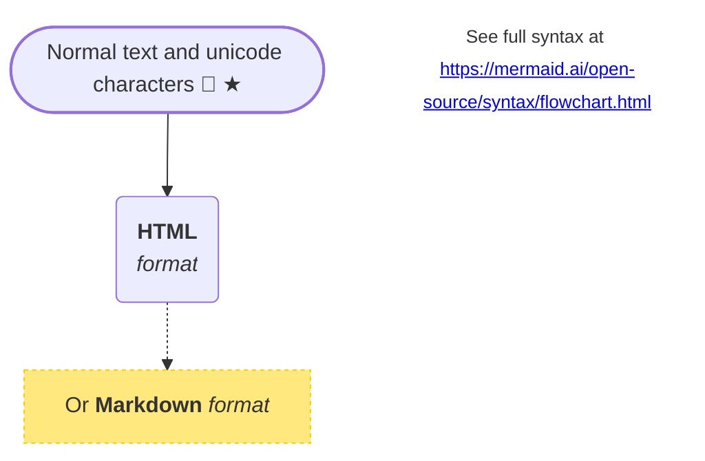

Mermaid <https://mermaid.ai/> is "Markdown inspired" diagrams as code. With the diagram defined as text, special/proprietary software isn't needed to create or edit diagrams. The text defining the diagrams can be edited by anyone - so can be kept up-to-date. Diagrams can also be version controlled, like any other code.

This matters because better diagrams improve documentation, and communication.

Mermaid supports a lot of different diagram types (flowcharts, Gantt charts, mindmaps, and org charts, among others). Mermaid syntax is supported in Confluence, GitHub, VS Code, MediaWiki, and more.

If you don't want to fiddle with text, there's online, free tools to visually create diagrams, which can then be exported to Mermaid syntax (though be aware, there's perhaps not the level of fine-grained control that might be expected using afore-mentioned proprietary software like Visio or <https://app.diagrams.net/>, which is a trade-off for the simplicity of text).

Here's a simple example of a flowchart diagram in Mermaid. The code block below results in the diagram underneath:

````

````



I use these sort of diagrams for quick, high-level system architecture. Rendered in a browser, text in the diagram is selectable and links can be clicked.

Of course, there's a lot more than can be done with regards to styling & font, layout, dark mode etc. In the flowchart above, I use single upper-case letters to refer to "nodes", with the displayed text separate (which makes connecting, referencing and styling nodes easier).

Some other useful Mermaid flowchart styling:

- dotted lines on nodes: `style <node> stroke-dasharray:3` _(or even dots and dashes, see <https://developer.mozilla.org/en-US/docs/Web/SVG/Reference/Attribute/stroke-dasharray>)_
- node text color: `style <node> color:<hex color code>`
- node background color: `style <node> fill:<hex color code>`
- node border width: `style <node> stroke-width:<number><unit e.g. "px", "pt">`

Here's how to add Mermaid to a Jekyll blog, based on <https://stuff-things.net/2025/01/19/mermaid-diagramming-in-jekyll-in-2025/>:

- create a new file _mermaid.html_ in the __includes_ directory
- put the following code into _mermaid.html_:

```js
<script type="module">
  /* latest version of Mermaid diagrams
     adapted from https://stuff-things.net/2025/01/19/mermaid-diagramming-in-jekyll-in-2025/ */
  import mermaid from 'https://cdn.jsdelivr.net/npm/mermaid/dist/mermaid.esm.min.mjs';
  /* initialise Mermaid */
  mermaid.initialize({ startOnLoad: true, theme: 'default' });
  /* run Mermaid on the page, looking for code blocks with the class 'language-mermaid' */
  await mermaid.run({
    /* specify the CSS selector for Mermaid code blocks
       by default, Mermaid looks for elements with the class 'mermaid', but thanks to Jekyll there's
       "language-" in front when using triple-backtick code blocks */
    querySelector: '.language-mermaid'
  });
</script>
```

- add the following lines to your Jekyll HTML head template (mine is in a file called _head.html_):

```html
<!-- if "mermaid" flag is true, include snippet -->

```

- in the front-matter for a post, add the following to enable Mermaid:

```yaml
mermaid: true
```

With the above in place, you can define a Mermaid code block in a blog post, and it will be rendered as a diagram.
